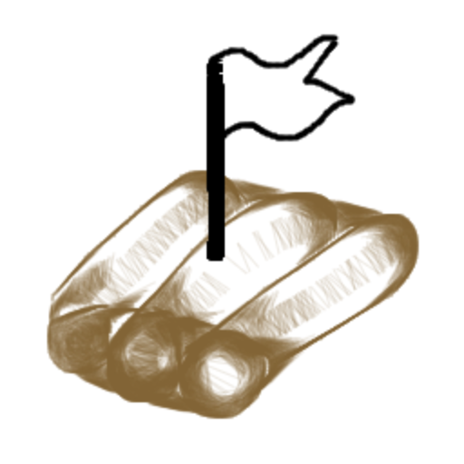

<p align="center"></p>
<p align="center">
    </img>
    <h1 align="center">Raft</h1>
    <p align="center">Proof of concept implementation of the <a href="https://raft.github.io">Raft consensus algorithm</a>.</p>
    <p align="center">
        <a href="https://github.com/ulysseses/raft/actions"></a>
        <a href="https://github.com/ulysseses/raft/actions"></a>
        
    </p>
</p>

---

GoDoc: https://godoc.org/github.com/ulysseses/raft

## Tooling dependencies

```bash
cd $GOPATH/src
go get -u github.com/gogo/protobuf/protoc-gen-gofast
github.com/gogo/protobuf/install-protobuf.sh  # it you don't already have protoc
```

## Example KV Store

### Run a pre-configured 3-node cluster

```bash
cd examples/kvstore/server
source ./utils.sh
start3cluster
# eventually call stop3cluster
```

### Or run the cluster yourself manually

```bash
cd examples/kvstore/server
go build

# in one process
./server \
  -addr :3001 \
  -id 1 \
  -addresses "1,tcp://localhost:8081|2,tcp://localhost:8082|3,tcp://localhost:8083"

# in another process
./server \
  -addr :3002 \
  -id 2 \
  -addresses "1,tcp://localhost:8081|2,tcp://localhost:8082|3,tcp://localhost:8083"

# in yet another process
./server \
  -addr :3003 \
  -id 3 \
  -addresses "1,tcp://localhost:8081|2,tcp://localhost:8082|3,tcp://localhost:8083"
```

### Interact with the cluster!

You can perform set & get operations against `/store`, e.g.

```bash
curl -XPUT "http://localhost:3001/store?k=hi&v=bye"
curl -XGET "http://localhost:3002/store?k=hi"
```

You can also check out the current Raft node state as well as its point of views of all of the Raft cluster members:

```bash
curl -XGET "http://localhost:3003/state"
curl -XGET "http://localhost:3003/members"
```

Finally, there's always the trusty `/debug/pprof/` endpoint.

## Building Protobuf files

```bash
# make sure you're in repo base
protoc \
  -I pb/ \
  -I $GOPATH/src \
  pb/raft.proto \
  --gogofaster_out=plugins=grpc:pb

protoc \
  -I examples/kvstore/kvpb/ \
  -I $GOPATH/src \
  examples/kvstore/kvpb/kv.proto \
  --gogofaster_out=plugins=grpc:examples/kvstore/kvpb
```

## Testing and Benchmarking

```bash
$ go test -v -timeout=5m -race .
=== RUN   Test_3Node_StartAndStop
--- PASS: Test_3Node_StartAndStop (2.50s)
=== RUN   Test_3Node_ConsistencyStrict_RoundRobin
--- PASS: Test_3Node_ConsistencyStrict_RoundRobin (3.90s)
=== RUN   Test_3Node_ConsistencyLease_RoundRobin
--- PASS: Test_3Node_ConsistencyLease_RoundRobin (4.00s)
=== RUN   Test_heartbeatTicker
--- PASS: Test_heartbeatTicker (0.01s)
=== RUN   Test_electionTicker
--- PASS: Test_electionTicker (0.02s)
=== RUN   ExampleApplication_register
--- PASS: ExampleApplication_register (2.10s)
PASS
ok  	github.com/ulysseses/raft	12.684s
```

```bash
$ go test -v -timeout=5m -run=^$ -bench=. -benchmem -args -test.disableLogging
goos: darwin
goarch: amd64
pkg: github.com/ulysseses/raft
Benchmark_gRPCTransport_RTT-8                    	   70150	     16047 ns/op	     597 B/op	      16 allocs/op
Benchmark_3Node_ConsistencyStrict_RoundRobin-8   	      10	 159876203 ns/op	    1284 B/op	      21 allocs/op
Benchmark_3Node_ConsistencyLease_RoundRobin-8    	      12	 166358829 ns/op	    1242 B/op	      21 allocs/op
Benchmark_1Node_ConsistencyLease_RoundRobin-8    	  180129	      6115 ns/op	     863 B/op	      13 allocs/op
PASS
ok  	github.com/ulysseses/raft	32.979s
```

## License

This project is licensed under the MIT license.
